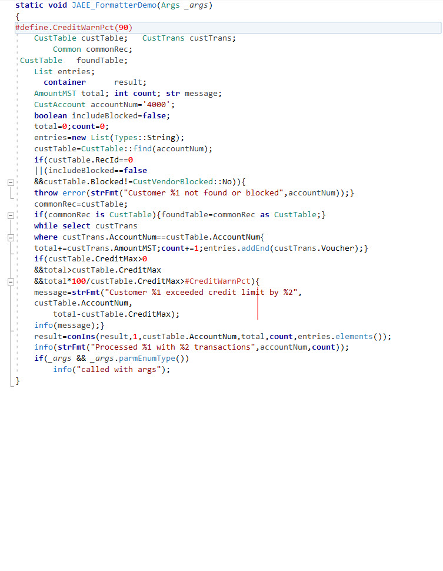
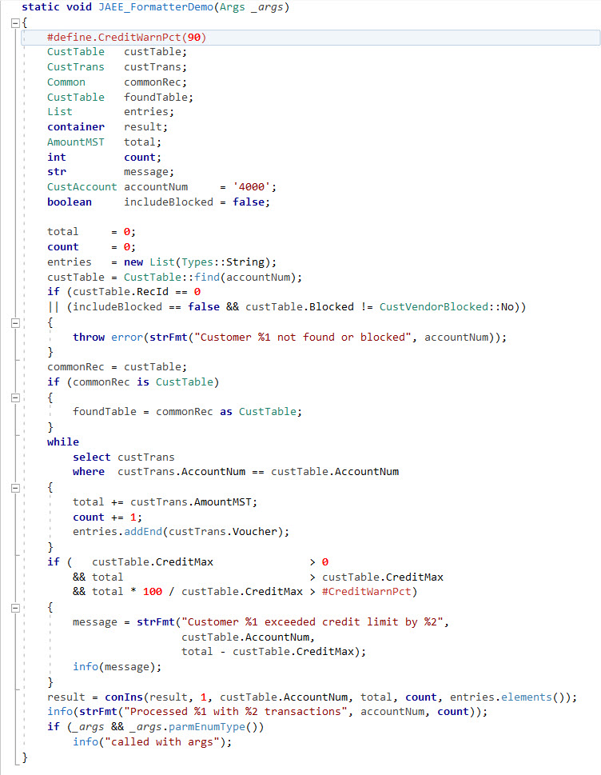
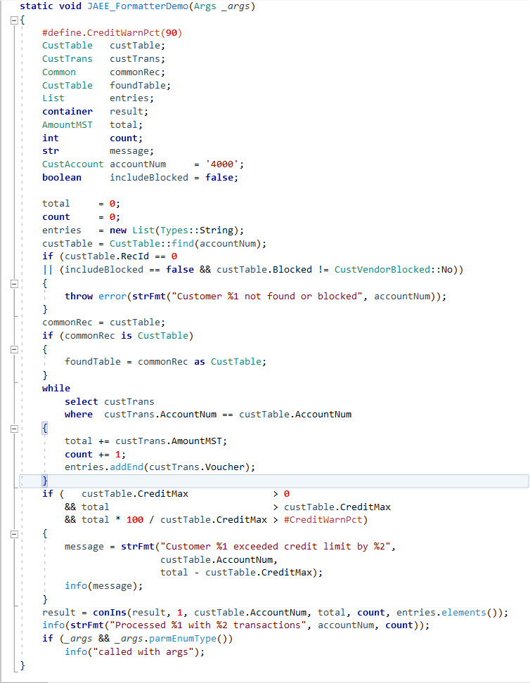
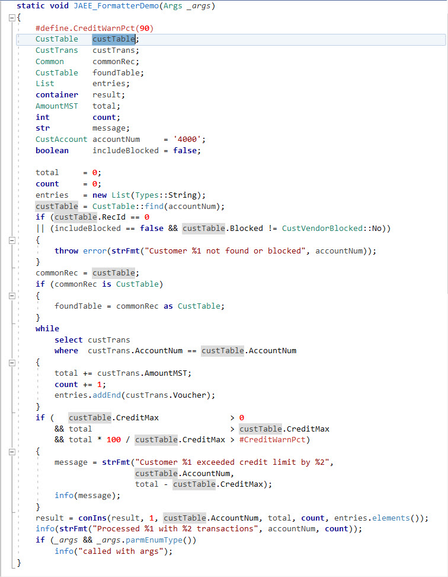
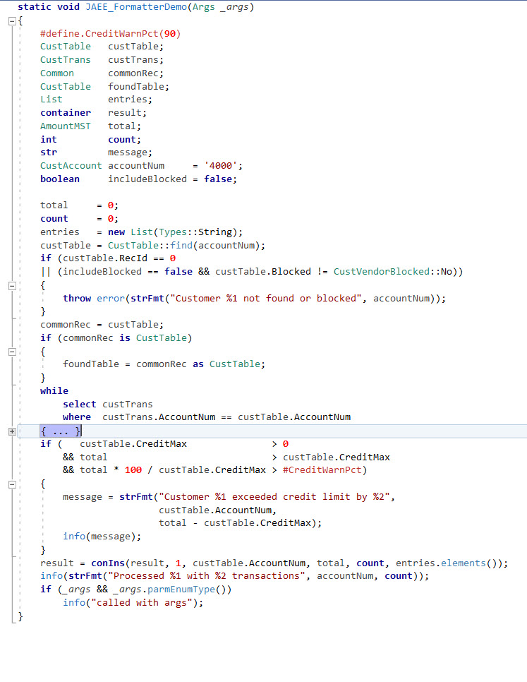
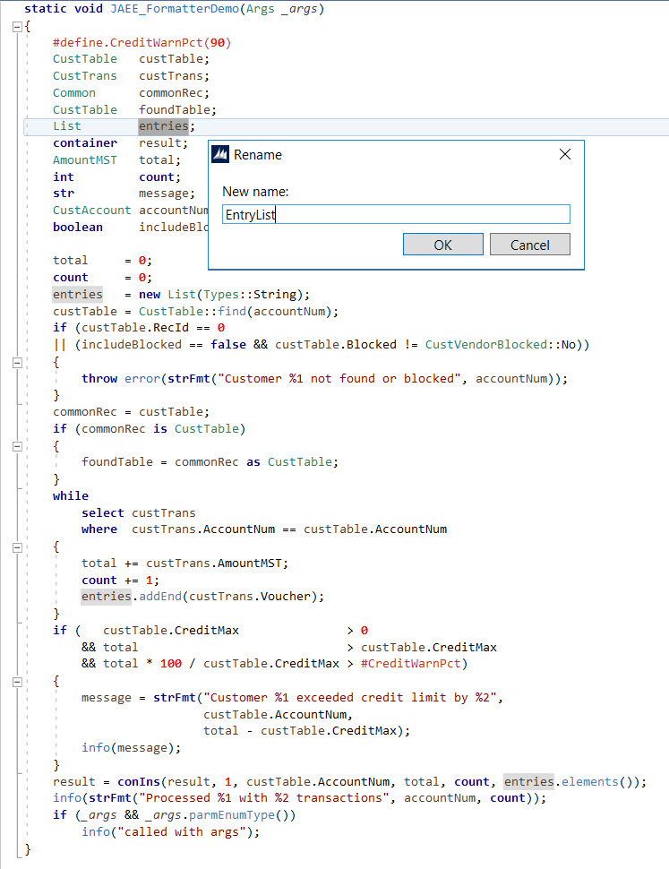

# Microsoft Dynamics AX 2012 X++ Editor Extensions

Editor extensions for the **Microsoft Dynamics AX 2012** X++ source-code editor: brace matching, word and line highlighting, outlining, plus a **formatter**, a **buffer-scoped rename**, and a **semantic syntax highlighter**. All settings live in one Windows Forms app.

This is a fork of [jaestevan/AX2012-Editor-Extensions](https://github.com/jaestevan/AX2012-Editor-Extensions) (via [nzrysldg](https://github.com/nzrysldg/AX2012-Editor-Extensions)), modernized to **.NET Framework 4.8** — it builds under the Build Tools alone (no VS2010 SDK, no admin rights).

## Extensions

Inherited from the original project:

- **Brace Matching** — highlights the brace matching the one at the caret (`{ }`, `( )`, `[ ]`).
- **Highlight Word** — highlights every occurrence of the word under the caret.
- **Current-Line Highlight** — tints the line the caret is on.
- **Outlining** — collapsible regions with a hover-tooltip preview.

Added in this fork:

- **Format** — `Ctrl+Shift+F`, *Format Document* for X++. Whitespace-only and safety-verified (the token stream is guaranteed unchanged): aligns declaration and assignment columns, lays out `select` statements SQL-style, and chops multi-line argument lists and boolean conditions (leading `&&` / `||` under the `(`, with an aligned compare column). See [`JAEEFormatExtension/README.md`](src/JAEEFormatExtension/README.md).
- **Refactor Rename** — `Ctrl+R`, VS-style buffer-scoped whole-word rename.
- **Syntax Highlighter** — semantic coloring of types, macros, instance/static method calls, global functions, and (muted) parameter and local variables.

Colors and per-feature toggles live in the settings app (`JAEE.AX.EditorExtensions.EditorSettingsForm.exe`), which includes a *Reset to Defaults* button.

## Install

Grab the zip from [Releases](../../releases/latest), **close the AX client**, and copy the DLLs into:

```
…\60\Client\Bin\EditorComponents\
```

Or run [`Install-Local.bat`](src/Install-Local.bat), which copies every extension DLL for you. Reopen the AX client to load them.

## Build &amp; release

- **Build:** open `src/JAEE.AX.EditorExtensions.sln`. First place the six Microsoft VS editor DLLs in `References/` — see [`References/README.md`](References/README.md). (`JAEERefactorRenameExtension` isn't in the .sln; build that project on its own.)
- **Version — one place for all assemblies:** [`SharedAssemblyInfo.cs`](src/SharedAssemblyInfo.cs) (currently **1.3.2.0**). To ship a new version, edit the two numbers there, rebuild, then tag and release. e.g. for 1.4.0:

  ```csharp
  [assembly: AssemblyVersion("1.4.0.0")]
  [assembly: AssemblyFileVersion("1.4.0.0")]
  ```
- **Tests:** `dotnet run --project src/Tests/FormatTests`

## Screenshots

### Format

Before `Ctrl+Shift+F`:



After:



### Syntax Highlighter


### Brace Matching



### Highlight Word



### Outlining



### Refactor Rename



## Credits

Original project by [José Antonio Estevan](https://github.com/jaestevan/AX2012-Editor-Extensions), built on the MSDN Visual Studio 2010 editor-extension samples.
